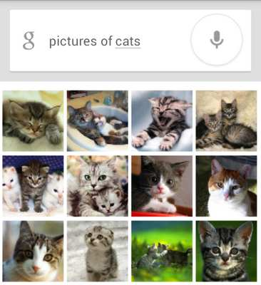

# 机器学习笔记

## 例子引入

### 约会问题

#### 问题描述
小M与小Y约会, 但小Y不是那么守时，最常见的表现是她经常迟到。当有一次小M跟小Y约好3点钟在某个KFC见面时，在小M出发那一刻突然想到一个问题：我现在出发合适么？我会不会又到了地点后，花上30分钟去等她？小M决定采取一个策略解决这个问题。

#### 策略思路
要想解决尽量减少小M等待时间这个问题，有好几种方法。

1. 小M搜寻能够解决这个问题的知识。但很遗憾，没有人会把如何等人这个问题作为知识传授，因此他不可能找到已有的知识能够解决这个问题。
2. 问他人：小M去询问他人获得解决这个问题的能力。但是同样的，这个问题没有人能够解答，因为可能没人碰上跟小M一样的情况。
3. 准则法：小M问自己的内心，有否设立过什么准则去面对这个问题？例如，无论别人如何，小M都会守时到达。但小M不是个死板的人，没有设立过这样的规则。
4. 小M把过往跟小Y相约的经历在脑海中重现一下，看看跟她相约的次数中，迟到占了多大的比例。而利用这来预测小Y这次迟到的可能性。如果这个值超出了小M心里的某个界限，那选择等一会再出发。假设小M跟小Y约过5次，迟到的次数是1次，那么小Y按时到的比例为80%，小M心中的阈值为70%，小M认为这次小Y应该不会迟到，因此小M按时出门。如果小Y在5次迟到的次数中占了4次，也就是小Y按时到达的比例为20%，由于这个值低于下M的阈值，因此小M选择推迟出门的时间。这个方法从它的利用层面来看，又称为经验法。在经验法的思考过程中，小M事实上利用了以往所有相约的数据。因此也可以称之为依据数据做的判断。

#### 近似机器学习
方法4所做的判断跟机器学习的思想根本上是一致的。

刚才的思考过程小M只考虑“频次”这种属性。在真实的机器学习中，这可能都不算是一个应用。

一般的机器学习模型至少考虑两个量：

1. 因变量，也就是小M希望预测的结果，在这个例子里就是小Y迟到与否的判断。
2. 自变量，也就是用来预测小Y是否迟到的量。假设小M把时间作为自变量，譬如小M发现小Y所有迟到的日子基本都是星期五，而在非星期五情况下他基本不迟到。于是小M可以建立一个模型，来模拟小Y迟到与否跟日子是否是星期五的概率。
 

这样的图就是一个最简单的机器学习模型，称之为决策树。

当我们考虑的自变量只有一个时，情况较为简单。如果把我们的自变量再增加一个。例如小Y迟到的部分情况时是在他开车过来的时候(你可以理解为他开车水平较臭，或者路较堵)。于是我可以关联考虑这些信息。建立一个更复杂的模型，这个模型包含两个自变量与一个因变量。

再更复杂一点，小Y的迟到跟天气也有一定的原因，例如下雨的时候，这时候我需要考虑三个自变量。

如果我希望能够预测小Y迟到的具体时间，我可以把他每次迟到的时间跟雨量的大小以及前面考虑的自变量统一建立一个模型。于是我的模型可以预测值，例如他大概会迟到几分钟。这样可以帮助我更好的规划我出门的时间。在这样的情况下，决策树就无法很好地支撑了，因为决策树只能预测离散值。

如果我把这些建立模型的过程交给电脑。比如把所有的自变量和因变量输入，然后让计算机帮我生成一个模型，同时让计算机根据我当前的情况，给出我是否需要迟出门，需要迟几分钟的建议。那么计算机执行这些辅助决策的过程就是机器学习的过程。

机器学习方法是计算机利用已有的数据(经验)，得出了某种模型(迟到的规律)，并利用此模型预测未来(是否迟到)的一种方法。

通过上面的分析，可以看出机器学习与人类思考的经验过程是类似的，不过它能考虑更多的情况，执行更加复杂的计算。事实上，机器学习的一个主要目的就是把人类思考归纳经验的过程转化为计算机通过对数据的处理计算得出模型的过程。经过计算机得出的模型能够以近似于人的方式解决很多灵活复杂的问题。

### 房价问题

#### 问题描述

现在我手里有一栋房子需要售卖，我应该给它标上多大的价格？房子的面积是100平方米，价格是100万，120万，还是140万？

很显然，我希望获得房价与面积的某种规律。那么我该如何获得这个规律？用报纸上的房价平均数据么？还是参考别人面积相似的？

#### 策略思路

我现在希望获得一个合理的，并且能够最大程度的反映面积与房价关系的规律。于是我调查了周边与我房型类似的一些房子，获得一组数据。这组数据中包含了大大小小房子的面积与价格，如果我能从这组数据中找出面积与价格的规律，那么我就可以得出房子的价格。

对规律的寻找很简单，拟合出一条直线，让它“穿过”所有的点，并且与各个点的距离尽可能的小。

通过这条直线，我获得了一个能够最佳反映房价与面积规律的规律。这条直线同时也是一个下式所表明的函数：
   
    房价 = 面积 * a + b

上述中的a、b都是直线的参数。获得这些参数以后，我就可以计算出房子的价格。

假设`a = 0.75`,`b = 50`，则`房价 = 100 * 0.75 + 50 = 125万`。这个结果与我前面所列的100万，120万，140万都不一样。由于这条直线综合考虑了大部分的情况，因此从“统计”意义上来说，这是一个最合理的预测。

#### 解析
在求解过程中透露出了两个信息：

1. 房价模型是根据拟合的函数类型决定的。如果是直线，那么拟合出的就是直线方程。如果是其他类型的线，例如抛物线，那么拟合出的就是抛物线方程。机器学习有众多算法，一些强力算法可以拟合出复杂的非线性模型，用来反映一些不是直线所能表达的情况。

2. 如果我的数据越多，我的模型就越能够考虑到越多的情况，由此对于新情况的预测效果可能就越好。这是机器学习界**“数据为王”**思想的一个体现。一般来说(不是绝对)，数据越多，最后机器学习生成的模型预测的效果越好。

通过拟合直线的过程，我们可以对机器学习过程做一个完整的回顾。首先，我们需要在计算机中存储历史的数据。

接着，我们将这些数据通过机器学习算法进行处理，这个过程在机器学习中叫做**“训练”**，处理的结果可以被我们用来对新的数据进行预测，这个结果一般称之为**“模型”**。对新数据的预测过程在机器学习中叫做**“预测”**。

“训练”与“预测”是机器学习的两个过程，“模型”则是过程的中间输出结果，“训练”产生“模型”，“模型”指导 “预测”。

### 思考题

在车站被查身份证概率的预测

### Google Brain项目

2012年6月，《纽约时报》披露了Google Brain项目，吸引了公众的广泛关注。这个项目是由著名的斯坦福大学的机器学习教授Andrew Ng和在大规模计算机系统方面的世界顶尖专家JeffDean共同主导，用16000个CPU Core的并行计算平台训练一种称为“深度神经网络”（DNN，Deep Neural Networks）的机器学习模型（内部共有10亿个节点。这一网络自然是不能跟人类的神经网络相提并论的。要知道，人脑中可是有150多亿个神经元，互相连接的节点也就是突触数更是如银河沙数。曾经有人估算过，如果将一个人的大脑中所有神经细胞的轴突和树突依次连接起来，并拉成一根直线，可从地球连到月亮，再从月亮返回地球），在语音识别和图像识别等领域获得了巨大的成功。

项目负责人之一Andrew称：“我们没有像通常做的那样自己框定边界，而是直接把海量数据投放到算法中，让数据自己说话，系统会自动从数据中学习。”另外一名负责人Jeff则说：“我们在训练的时候从来不会告诉机器说：‘这是一只猫。’系统其实是自己发明或者领悟了“猫”的概念。”

## 基本概念

人类在成长、生活过程中积累了很多的历史与经验。人类定期地对这些经验进行“归纳”，获得了生活的“规律”。当人类遇到未知的问题或者需要对未来进行“推测”的时候，人类使用这些“规律”，对未知问题与未来进行“推测”，从而指导自己的生活和工作。

机器学习中的“训练”与“预测”过程可以对应到人类的“归纳”和“推测”过程。通过这样的对应，我们可以发现，机器学习的思想并不复杂，仅仅是对人类在生活中学习成长的一个模拟。**由于机器学习不是基于编程形成的结果，因此它的处理过程不是因果的逻辑，而是通过归纳思想得出的相关性结论。**

这也可以联想到人类为什么要学习历史，历史实际上是人类过往经验的总结。有句话说得很好，“历史往往不一样，但历史总是惊人的相似”。通过学习历史，我们从历史中归纳出人生与国家的规律，从而指导我们的下一步工作，这是具有莫大价值的。

### 人工智能（Artificial Intelligence）

上图简单而直观的表明了人工智能，机器学习，深度学习的关系及区别，人工智能范畴最广，机器学习，深度学习逐步缩小；其实机器学习与深度学习可以看作人工智能的内部模型提炼过程，人工智能则是对外部的智能反应。

人工智能学术定义为用于研究，模拟及扩展人的智能应用科学；AI在计算机领域研究涉及机器人，语言识别，图像识别，自然语言处理等。AI的研究会横跨多门学科，如计算机，数学，生物，语言，声音，视觉甚至心理学和哲学。

其中AI的核心是做到感知，推断，行动及根据经验值进行调整，即类似人类的智慧体智能学习提升。

### 机器学习

机器学习是人工智能的一个分支。人工智能的研究是从以“推理”为重点到以“知识”为重点，再到以“学习”为重点，一条自然、清晰的脉络。显然，机器学习是实现人工智能的一个途径，即以机器学习为手段解决人工智能中的问题。

机器学习理论主要是设计和分析一些让计算机可以自动“学习”的算法。

机器学习的学究的定义为“计算机程序如何随着经验积累自动提高性能”，经典英文定义为
“A computer program is said to learn from experience E with respect to some class of tasks T and performance measure P, if its performance at tasks in T, as measured by P, improves with experience E.”，即“对于某类任务T和性能度量P，如果一个计算机程序在T上以P衡量的性能随着经验E而自我完善，那么我们称这个计算机程序在从经验E学习”， 通俗点说既是让机器来模拟人类来学习新的知识与技能，重点是不是通过某精妙算法而达成，而是让程序去通过学习发现提高，举一反三， 正所谓授之以鱼不如授之以渔。

从广义上来说，机器学习是一种能够赋予机器学习的能力以此让它完成直接编程无法完成的功能的方法。但从实践的意义上来说，机器学习是一种通过利用数据，训练出模型，然后使用模型预测的一种方法。

### 涉及领域

#### 模式识别(Pattern Recognition)

模式识别=机器学习。

两者的主要区别在于前者是从工业界发展起来的概念，后者则主要源自计算机学科。

在著名的《Pattern Recognition And Machine Learning》这本书中，Christopher M. Bishop在开头是这样说的“模式识别源自工业界，而机器学习来自于计算机学科。不过，它们中的活动可以被视为同一个领域的两个方面，同时在过去的10年间，它们都有了长足的发展”。

#### 数据挖掘

数据挖掘=机器学习+数据库。

这几年数据挖掘的概念实在是太耳熟能详。几乎等同于炒作。但凡说数据挖掘都会吹嘘数据挖掘如何如何，例如从数据中挖出金子，以及将废弃的数据转化为价值等等。但是，我尽管可能会挖出金子，但我也可能挖的是“石头”啊。这个说法的意思是，数据挖掘仅仅是一种思考方式，告诉我们应该尝试从数据中挖掘出知识，但不是每个数据都能挖掘出金子的，所以不要神话它。一个系统绝对不会因为上了一个数据挖掘模块就变得无所不能(这是IBM最喜欢吹嘘的)，恰恰相反，一个拥有数据挖掘思维的人员才是关键，而且他还必须对数据有深刻的认识，这样才可能从数据中导出模式指引业务的改善。

大部分数据挖掘中的算法是机器学习的算法在数据库中的优化。

#### 统计学习

统计学习近似等于机器学习。

统计学习是个与机器学习高度重叠的学科。因为机器学习中的大多数方法来自统计学，甚至可以认为，统计学的发展促进机器学习的繁荣昌盛。

例如著名的支持向量机算法，就是源自统计学科。但是在某种程度上两者是有分别的，这个分别在于：统计学习者重点关注的是统计模型的发展与优化，偏数学，而机器学习者更关注的是能够解决问题，偏实践，因此机器学习研究者会重点研究学习算法在计算机上执行的效率与准确性的提升。

#### 计算机视觉

计算机视觉=图像处理+机器学习。

图像处理技术用于将图像处理为适合进入机器学习模型中的输入，机器学习则负责从图像中识别出相关的模式。计算机视觉相关的应用非常的多，例如百度识图、手写字符识别、车牌识别等等应用。这个领域是应用前景非常火热的，同时也是研究的热门方向。随着机器学习的新领域深度学习的发展，大大促进了计算机图像识别的效果，因此未来计算机视觉界的发展前景不可估量。
　　
#### 语音识别

语音识别=语音处理+机器学习。

语音识别就是音频处理技术与机器学习的结合。语音识别技术一般不会单独使用，一般会结合自然语言处理的相关技术。目前的相关应用有苹果的语音助手siri等。

#### 自然语言处理

自然语言处理=文本处理+机器学习。

自然语言处理技术主要是让机器理解人类的语言的一门领域。在自然语言处理技术中，大量使用了编译原理相关的技术，例如词法分析，语法分析等等，除此之外，在理解这个层面，则使用了语义理解，机器学习等技术。作为唯一由人类自身创造的符号，自然语言处理一直是机器学习界不断研究的方向。按照百度机器学习专家余凯的说法“听与看，说白了就是阿猫和阿狗都会的，而只有语言才是人类独有的”。如何利用机器学习技术进行自然语言的的深度理解，一直是工业和学术界关注的焦点。

## 学习方法分类

On basis of the nature of the learning “signal” or “feedback” available to a learning system.

根据数据类型的不同，对一个问题的建模有不同的方式。在机器学习或者人工智能领域，人们首先会考虑算法的学习方式。在机器学习领域，有几种主要的学习方式。将算法按照学习方式分类是一个不错的想法，这样可以让人们在建模和算法选择的时候考虑能根据输入数据来选择最合适的算法来获得最好的结果。

### 监督学习（Supervised Learning）

The computer is presented with example inputs and their desired outputs, given by a “teacher”, and the goal is to learn a general rule that maps inputs to outputs. The training process continues until the model achieves a desired level of accuracy on the training data. 

监督学习从给定的训练数据集中学习出一个函数，当新的数据到来时，可以根据这个函数预测结果。

监督学习类似我们在学校的学习，通常的题目都会有“正确答案”，以便于我们每学期学习结束（训练），参加未知的考试作为检验。

通常对具有标记分类的训练样本特征进行学习，标记即已经知道其对应正确分类答案；而学习则本质是找到特征与标签（正确答案）之间的关系（函数），从而当训练结束，输入无标签的数据时，可以利用已经找出的关系方法进行分析得出数据标签。

这个算法由一个目标变量或结果变量（或因变量）组成。这些变量由已知的一系列预示变量（自变量）预测而来。利用这一系列变量，我们生成一个将输入值映射到期望输出值的函数。这个训练过程会一直持续，直到模型在训练数据上获得期望的精确度。监督式学习的例子有：回归、决策树、随机森林、K – 近邻算法、逻辑回归等。

上图为监督学习的模型及流程:

1. 获取数据并确定所处理数据类型
2. 确定并提取训练数据集的特征（feature）
3. 选择机器学习方法如向量机或决策树
4. 获取最终机器模型
5. 对机器学习模型进行评估

#### 例子

- Image Classification: You train with images/labels. Then in the future you give a new image expecting that the computer will recognize the new object.
- Market Prediction/Regression: You train the computer with historical market data and ask the computer to predict the new price in the future.

### 无监督学习（Unsupervised Learning）

No labels are given to the learning algorithm, leaving it on its own to find structure in its input. It is used for clustering population in different groups. Unsupervised learning can be a goal in itself (discovering hidden patterns in data).

无监督学习则通常学习数据只有特征向量，没有标签（答案），学习模型通过学习特征向量发现其内部规律与性质，从而把数据分组聚类（Clustering）。

举个例子，如果把监督学习看作未成年时在家长及老师的“监督”下做告知正确的事，则无监督学习就是成年后踏入社会，自己去探索，发现，适应社会了。

无监督学习的用途则主要用来在未知（无标签）数据中发现相似或者隐藏结构并进行聚类（Clustering），或者发现数据对应输入空间的分布之密度估计等。

在无监督式学习中，数据并不被特别标识，学习模型是为了推断出数据的一些内在结构。常见的应用场景包括关联规则的学习以及聚类等。常见算法包括Apriori算法以及k-Means算法。

在这个算法中，没有任何目标变量或结果变量要预测或估计。这个算法用在不同的组内聚类分析。这种分析方式被广泛地用来细分客户，根据干预的方式分为不同的用户组。非监督式学习的例子有：关联算法和 K – 均值算法。

As you can see clearly, the data in supervised learning is labelled, where as data in unsupervised learning is unlabelled.

无监督学习的目的是学习一个function f，使它可以描述给定数据的位置分布P(Z)。

#### 例子

- Clustering: You ask the computer to separate similar data into clusters, this is essential in research and science.
- High Dimension Visualization: Use the computer to help us visualize high dimension data.
- Generative Models: After a model captures the probability distribution of your input data, it will be able to generate more data. This can be very useful to make your classifier more robust.

### 半监督学习（Semi-supervised learning）

介于监督学习与无监督学习之间。

Problems where you have a large amount of input data and only some of the data is labeled, are called semi-supervised learning problems. These problems sit in between both supervised and unsupervised learning. For example, a photo archive where only some of the images are labeled, (e.g. dog, cat, person) and the majority are unlabeled.

在此学习方式下，输入数据部分被标识，部分没有被标识，这种学习模型可以用来进行预测，但是模型首先需要学习数据的内在结构以便合理的组织数据来进行预测。应用场景包括分类和回归，算法包括一些对常用监督式学习算法的延伸，这些算法首先试图对未标识数据进行建模，在此基础上再对标识的数据进行预测。如图论推理算法（Graph Inference）或者拉普拉斯支持向量机（Laplacian SVM.）等。

### 强化学习（Reinforcement learning）

A computer program interacts with a dynamic environment in which it must perform a certain goal (such as driving a vehicle or playing a game against an opponent). The program is provided feedback in terms of rewards and punishments as it navigates its problem space.

强化学习是机器学习中的一个领域，强调如何基于环境而行动，以取得最大化的预期利益。其灵感来源于心理学中的行为主义理论，即有机体如何在环境给予的奖励或惩罚的刺激下，逐步形成对刺激的预期，产生能获得最大利益的习惯性行为。

强化学习和标准的监督式学习之间的区别在于，它并不需要出现正确的输入/输出对，也不需要精确校正次优化的行为。强化学习更加专注于在线规划，需要在探索（在未知的领域）和遵从（现有知识）之间找到平衡。强化学习中的“探索-遵从”的交换。

在这种学习模式下，输入数据作为对模型的反馈，不像监督模型那样，输入数据仅仅是作为一个检查模型对错的方式，在强化学习下，输入数据直接反馈到模型，模型必须对此立刻作出调整。常见的应用场景包括动态系统以及机器人控制等。常见算法包括Q-Learning以及时间差学习（Temporal difference learning）

在企业数据应用的场景下，人们最常用的可能就是监督式学习和非监督式学习的模型。 在图像识别等领域，由于存在大量的非标识的数据和少量的可标识数据， 目前半监督式学习是一个很热的话题。而强化学习更多的应用在机器人控制及其他需要进行系统控制的领域。

## 算法分类

On the basis of “output” desired from a machine learned system.

### 回归(Regression)

Regression: It is also a supervised learning problem, but the outputs are continuous rather than discrete. For example, predicting the stock prices using historical data.

属于监督学习，回归问题通常是用来预测一个值，如预测房价、未来的天气情况等等，例如一个产品的实际价格为500元，通过回归分析预测值为499元，我们认为这是一个比较好的回归分析。一个比较常见的回归算法是线性回归算法（LR）。回归是对真实值的一种逼近预测。

在回归问题中，输出可取任意实数，是连续的。定量输出称为回归，或者说是连续变量预测。

预测明天的气温是多少度，这是一个回归任务。

### 分类(classification)

Inputs are divided into two or more classes, and the learner must produce a model that assigns unseen inputs to one or more (multi-label classification) of these classes. This is typically tackled in a supervised way. Spam filtering is an example of classification, where the inputs are email (or other) messages and the classes are “spam” and “not spam”.

属于监督学习，分类问题是用于将事物打上一个标签，通常结果为离散值。例如判断一幅图片上的动物是一只猫还是一只狗，分类通常是建立在回归之上，分类并没有逼近的概念，最终正确结果只有一个，错误的就是错误的，不会有相近的概念。最常见的分类方法是逻辑回归，或者叫逻辑分类。

分类问题中，输出不仅仅只允许取两个值，可以允许多个值，它是离散的。定性输出称为分类，或者说是离散变量预测。

预测明天是阴、晴还是雨，就是一个分类任务。

An example of classification and regression on two different datasets is shown below:

### 聚类（Clustering)

Here, a set of inputs is to be divided into groups. Unlike in classification, the groups are not known beforehand, making this typically an unsupervised task.

As you can see in the example below, the given dataset points have been divided into groups identifiable by the colors red, yellow and blue.

聚类，就像回归一样，有时候人们描述的是一类问题，有时候描述的是一类算法。聚类算法通常按照中心点或者分层的方式对输入数据进行归并。所以的聚类算法都试图找到数据的内在结构，以便按照最大的共同点将数据进行归类。

将Z聚集几类（如K-Means），或者给出一个样本属于每一类的概率。由于不需要事先根据训练数据去train聚类器，故属于无监督学习。

### 密度估计(Density estimation)

The task is to find the distribution of inputs in some space.

密度估计，估计该数据在任意位置的分布密度。属于无监督学习。

### 降维(Dimensionality reduction)

It simplifies inputs by mapping them into a lower-dimensional space. Topic modeling is a related problem, where a program is given a list of human language documents and is tasked to find out which documents cover similar topics.

降维算法也是一种无监督学习算法，其主要特征是将数据从高维降低到低维层次。在这里，维度其实表示的是数据的特征量的大小，例如，房价包含房子的长、宽、面积与房间数量四个特征，也就是维度为4维的数据。可以看出来，长与宽事实上与面积表示的信息重叠了，例如面积=长 × 宽。通过降维算法我们就可以去除冗余信息，将特征减少为面积与房间数量两个特征，即从4维的数据压缩到2维。于是我们将数据从高维降低到低维，不仅利于表示，同时在计算上也能带来加速。

刚才说的降维过程中减少的维度属于肉眼可视的层次，同时压缩也不会带来信息的损失(因为信息冗余了)。如果肉眼不可视，或者没有冗余的特征，降维算法也能工作，不过这样会带来一些信息的损失。但是，降维算法可以从数学上证明，从高维压缩到的低维中最大程度地保留了数据的信息。因此，使用降维算法仍然有很多的好处。

降维算法的主要作用是压缩数据与提升机器学习其他算法的效率。通过降维算法，可以将具有几千个特征的数据压缩至若干个特征。另外，降维算法的另一个好处是数据的可视化，例如将5维的数据压缩至2维，然后可以用二维平面来可视。降维算法的主要代表是PCA算法(即主成分分析算法)。

## 常见的算法

### 线性回归(Linear Regression)

### 逻辑回归(Logistic Regression)

### 决策树(Decision Trees)

### 支持向量机(Support Vector Machines:SVM)

### 神经网络

### 朴素贝叶斯()

### K最近邻算法

### K均值算法

### 随机森林算法

### 降维算法

### Gradient Boost 和 Adaboost 算法

## 深度学习(Deep Learning)

### 浅层学习（Shallow Learning）

浅层学习是机器学习的第一次浪潮。

20世纪80年代末期，用于人工神经网络的反向传播算法（也叫Back Propagation算法或者BP算法）的发明，给机器学习带来了希望，掀起了基于统计模型的机器学习热潮。这个热潮一直持续到今天。人们发现，利用BP算法可以让一个人工神经网络模型从大量训练样本中学习统计规律，从而对未知事件做预测。这种基于统计的机器学习方法比起过去基于人工规则的系统，在很多方面显出优越性。这个时候的人工神经网络，虽也被称作多层感知机（Multi-layer Perceptron），但实际是种只含有一层隐层节点的浅层模型。

20世纪90年代，各种各样的浅层机器学习模型相继被提出，例如支撑向量机（SVM，Support Vector Machines）、 Boosting、最大熵方法（如LR，Logistic Regression）等。这些模型的结构基本上可以看成带有一层隐层节点（如SVM、Boosting），或没有隐层节点（如LR）。这些模型无论是在理论分析还是应用中都获得了巨大的成功。相比之下，由于理论分析的难度大，训练方法又需要很多经验和技巧，这个时期浅层人工神经网络反而相对沉寂。

### 概述

深度学习是机器学习研究中的一个新的领域，其动机在于建立、模拟人脑进行分析学习的神经网络，它模仿人脑的机制来解释数据，例如图像，声音和文本。**深度学习是无监督学习的一种。**

2006年，加拿大多伦多大学教授、机器学习领域的泰斗Geoffrey Hinton和他的学生RuslanSalakhutdinov在《科学》上发表了一篇文章，开启了深度学习在学术界和工业界的浪潮。这篇文章有两个主要观点：

1）多隐层的人工神经网络具有优异的特征学习能力，学习得到的特征对数据有更本质的刻画，从而有利于可视化或分类；

2）深度神经网络在训练上的难度，可以通过“逐层初始化”（layer-wise pre-training）来有效克服，在这篇文章中，逐层初始化是通过无监督学习实现的。

当前多数分类、回归等学习方法为浅层结构算法，其局限性在于有限样本和计算单元情况下对复杂函数的表示能力有限，针对复杂分类问题其泛化能力受到一定制约。深度学习可通过学习一种深层非线性网络结构，实现复杂函数逼近，表征输入数据分布式表示，并展现了强大的从少数样本集中学习数据集本质特征的能力。（多层的好处是可以用较少的参数表示复杂的函数）

深度学习的实质，是通过构建具有很多隐层的机器学习模型和海量的训练数据，来学习更有用的特征，从而最终提升分类或预测的准确性。因此，“深度模型”是手段，“特征学习”是目的。区别于传统的浅层学习，深度学习的不同在于：1）强调了模型结构的深度，通常有5层、6层，甚至10多层的隐层节点；2）明确突出了特征学习的重要性，也就是说，通过逐层特征变换，将样本在原空间的特征表示变换到一个新特征空间，从而使分类或预测更加容易。与人工规则构造特征的方法相比，利用大数据来学习特征，更能够刻画数据的丰富内在信息。

深度学习是机器学习研究中的一个新的领域，其动机在于建立、模拟人脑进行分析学习的神经网络，它模仿人脑的机制来解释数据，例如图像，声音和文本。深度学习是无监督学习的一种。

深度学习的概念源于人工神经网络的研究。含多隐层的多层感知器就是一种深度学习结构。深度学习通过组合低层特征形成更加抽象的高层表示属性类别或特征，以发现数据的分布式特征表示。

假设我们有一个系统S，它有n层（S1,…Sn），它的输入是I，输出是O，形象地表示为： I =>S1=>S2=>…..=>Sn => O，如果输出O等于输入I，即输入I经过这个系统变化之后没有任何的信息损失（呵呵，大牛说，这是不可能的。信息论中有个“信息逐层丢失”的说法（信息处理不等式），设处理a信息得到b，再对b处理得到c，那么可以证明：a和c的互信息不会超过a和b的互信息。这表明信息处理不会增加信息，大部分处理会丢失信息。当然了，如果丢掉的是没用的信息那多好啊），保持了不变，这意味着输入I经过每一层Si都没有任何的信息损失，即在任何一层Si，它都是原有信息（即输入I）的另外一种表示。现在回到我们的主题Deep Learning，我们需要自动地学习特征，假设我们有一堆输入I（如一堆图像或者文本），假设我们设计了一个系统S（有n层），我们通过调整系统中参数，使得它的输出仍然是输入I，那么我们就可以自动地获取得到输入I的一系列层次特征，即S1，…, Sn。

对于深度学习来说，其思想就是对堆叠多个层，也就是说这一层的输出作为下一层的输入。通过这种方式，就可以实现对输入信息进行分级表达了。

另外，前面是假设输出严格地等于输入，这个限制太严格，我们可以略微地放松这个限制，例如我们只要使得输入与输出的差别尽可能地小即可，这个放松会导致另外一类不同的Deep Learning方法。上述就是Deep Learning的基本思想。

Three Steps for Deep Learning:

1.define a set of function

2.goodness of function

3.pick the best function

### 人脑视觉机理

1981 年的诺贝尔医学奖，颁发给了 David Hubel（出生于加拿大的美国神经生物学家） 和TorstenWiesel，以及 Roger Sperry。前两位的主要贡献，是“发现了视觉系统的信息处理”：可视皮层是分级的：

我们看看他们做了什么。1958 年，DavidHubel 和Torsten Wiesel 在 JohnHopkins University，研究瞳孔区域与大脑皮层神经元的对应关系。他们在猫的后脑头骨上，开了一个3 毫米的小洞，向洞里插入电极，测量神经元的活跃程度。

然后，他们在小猫的眼前，展现各种形状、各种亮度的物体。并且，在展现每一件物体时，还改变物体放置的位置和角度。他们期望通过这个办法，让小猫瞳孔感受不同类型、不同强弱的刺激。

之所以做这个试验，目的是去证明一个猜测。位于后脑皮层的不同视觉神经元，与瞳孔所受刺激之间，存在某种对应关系。一旦瞳孔受到某一种刺激，后脑皮层的某一部分神经元就会活跃。经历了很多天反复的枯燥的试验，同时牺牲了若干只可怜的小猫，David Hubel 和Torsten Wiesel 发现了一种被称为“方向选择性细胞（Orientation Selective Cell）”的神经元细胞。当瞳孔发现了眼前的物体的边缘，而且这个边缘指向某个方向时，这种神经元细胞就会活跃。

这个发现激发了人们对于神经系统的进一步思考。神经-中枢-大脑的工作过程，或许是一个不断迭代、不断抽象的过程。

这里的关键词有两个，一个是抽象，一个是迭代。从原始信号，做低级抽象，逐渐向高级抽象迭代。人类的逻辑思维，经常使用高度抽象的概念。

例如，从原始信号摄入开始（瞳孔摄入像素 Pixels），接着做初步处理（大脑皮层某些细胞发现边缘和方向），然后抽象（大脑判定，眼前的物体的形状，是圆形的），然后进一步抽象（大脑进一步判定该物体是只气球）。

这个生理学的发现，促成了计算机人工智能，在四十年后的突破性发展。

总的来说，人的视觉系统的信息处理是分级的。从低级的V1区提取边缘特征，再到V2区的形状或者目标的部分等，再到更高层，整个目标、目标的行为等。也就是说高层的特征是低层特征的组合，从低层到高层的特征表示越来越抽象，越来越能表现语义或者意图。而抽象层面越高，存在的可能猜测就越少，就越利于分类。例如，单词集合和句子的对应是多对一的，句子和语义的对应又是多对一的，语义和意图的对应还是多对一的，这是个层级体系。

好了，到了这一步，终于可以聊到Deep learning了。上面我们聊到为什么会有Deep learning（让机器自动学习良好的特征，而免去人工选取过程。还有参考人的分层视觉处理系统），我们得到一个结论就是Deep learning需要多层来获得更抽象的特征表达。

### 神经网络(Neural Network)

(todo:单独成课)
#### 概述

深度学习的概念源于人工神经网络的研究。含多隐层的多层感知器就是一种深度学习结构。深度学习通过组合低层特征形成更加抽象的高层表示属性类别或特征，以发现数据的分布式特征表示。

Deep learning本身算是machine learning的一个分支，简单可以理解为neural network的发展。大约二三十年前，neural network曾经是ML领域特别火热的一个方向，但是后来确慢慢淡出了，原因包括以下几个方面：

1）比较容易过拟合，参数比较难调，而且需要不少技巧；

2）训练速度比较慢，在层次比较少（小于等于3）的情况下效果并不比其它方法更优；

所以中间有大约20多年的时间，神经网络被关注很少，这段时间基本上是SVM和boosting算法的天下。但是，一个痴心的老先生Hinton，他坚持了下来，并最终（和其它人一起Bengio、Yann.lecun等）提成了一个实际可行的deep learning框架。

Deep learning与传统的神经网络之间有相同的地方也有很多不同。

二者的相同在于deep learning采用了神经网络相似的分层结构，系统由包括输入层、隐层（多层）、输出层组成的多层网络，只有相邻层节点之间有连接，同一层以及跨层节点之间相互无连接，每一层可以看作是一个logistic regression模型；这种分层结构，是比较接近人类大脑的结构的。

### 相关框架

#### Caffe

[Caffe](http://caffe.berkeleyvision.org/)的全称是：Convolutional architecture forfast feature embedding，它是一个清晰、高效的深度学习框架，它是开源的，核心语言是C++，它支持命令行、Python和Matlab接口，它既可以在CPU上运行也可以在GPU上运行。它的license是BSD 2-Clause。

### 资源
- [李宏毅:一天搞懂深度學習](https://www.slideshare.net/tw_dsconf/ss-62245351)
- [Deep Learning（深度学习）学习笔记整理系列](http://blog.csdn.net/zouxy09/article/details/8775518)
- [神经网络浅讲：从神经元到深度学习](http://www.cnblogs.com/subconscious/p/5058741.html)
- [EasyPR--一个开源的中文车牌识别系统](http://www.cnblogs.com/subconscious/p/3979988.html)
- [《Mastering Opencv ...读书笔记系列》车牌识别](http://blog.csdn.net/jinshengtao/article/details/17883075)
- [thing-translator](https://github.com/dmotz/thing-translator)
- [Neural Networks 101](https://github.com/cazala/synaptic/wiki/Neural-Networks-101)

## 术语

### AI

人工智能（Artificial Intelligence）。

### 图灵测试

图灵测试（英语：Turing test，又译图灵试验）是图灵于1950年提出的一个关于判断机器是否能够思考的著名试验，测试某机器是否能表现出与人等价或无法区分的智能。测试的谈话仅限于使用唯一的文本管道，例如计算机键盘和屏幕，这样的结果是不依赖于计算机把单词转换为音频的能力。

### training

训练。

### prediction

预测。

### feature

特征。

## 资源

- [计算机的潜意识](http://www.cnblogs.com/subconscious/p/4107357.htm)
- [Machine Learning for JavaScript Hackers](http://harthur.github.io/txjs-slides)
- [Machine Learning-线性回归算法分析](http://www.jianshu.com/p/40e251127025)
- [Getting started with Machine Learning](http://www.geeksforgeeks.org/getting-started-machine-learning/)
- [机器学习-维基百科](https://zh.wikipedia.org/wiki/%E6%9C%BA%E5%99%A8%E5%AD%A6%E4%B9%A0)
- [图解机器学习](http://www.r2d3.us/%E5%9B%BE%E8%A7%A3%E6%9C%BA%E5%99%A8%E5%AD%A6%E4%B9%A0/)
- [机器学习资源大全中文版](https://github.com/jobbole/awesome-machine-learning-cn)
- [Awesome Machine Learning](https://github.com/josephmisiti/awesome-machine-learning)
- [10种机器学习算法的要点](http://blog.jobbole.com/92021/)
- [10 Machine Learning Examples in JavaScript](https://tutorialzine.com/2017/04/10-machine-learning-examples-in-javascript)
- [Self-driving cars in the browser](http://janhuenermann.com/projects/learning-to-drive)