# 机器学习涉及的数学知识

**贡献者：[李沁涛](https://github.com/andy-sh/notes)**

## Set(集合)

集合（英语：Set，或简称集）是基本的数学概念，它是集合论的研究对象，指具有某种特定性质的事物的总体，集合里的事物（“东西”），叫作元素。

A set is a well-defined collection of distinct objects. The objects that make up a set (also known as the elements or members of a set) can be anything: numbers, people, letters of the alphabet, other sets, and so on.

元素通常用 $a,\ b,\ c,\ d,\ x$等小写字母来表示；而集合通常用 $\mathbf{A,\ B,\ C,\ D,\ X}$等字母来表示。

当元素 $a$ 属于集合 $\mathbf{A}$时，$a\in\mathbf{A}$。

当元素 $a$不属于集合 $\mathbf{A}$时，记作 $a\not \in\mathbf{A}$。

如果 $\mathbf{A ,\ B}$两个集合所包含的元素完全一样，则二者相等，写作 $\mathbf{A = B}$。

### Element(元素)

In mathematics, an element, or member, of a set is any one of the distinct objects that make up that set.

## Interval(区间)

在数学里，区间通常是指这样的一类实数集合：如果$x$和$y$是两个在集合里的数，那么，任何$x$和$y$之间的数也属于该集合。例如，由符合$0 ≤ x ≤ 1$的实数所构成的集合，便是一个区间，它包含了0、1，还有0和1之间的全体实数。其他例子包括：实数集，负实数组成的集合等。

区间的定义可以推广到任何全序集 $T$的子集 $S$，使得若 $x$和 $y$均属于 $S$，且 $x<z<y$，则 $z$亦属于 $S$。

特别重要的情况是当 $T = \mathbb{R}$。
$\mathbb{R}$ 的区间有以下十一种（ $a$和 $b$为实数且 $a < b$）：

1. $(a,b)=\{x|a<x<b\}$ ，开区间，有界区间
2. $[a, b] = \{ x | a \le x \le b \}$，闭区间，有界区间
3. $[a, b) = \{ x | a \le x < b \}$，半开半闭区间，有界区间
4. $(a, b] = \{ x | a < x \le b \}$，半开半闭区间，有界区间
5. $(a, \infty) = \{ x | x > a \}$，开区间，无界区间
6. $[a, \infty) = \{ x | x \ge a \}$，闭区间，无界区间
7. $(-\infty, b) = \{ x | x < b \}$，开区间，无界区间
8. $(-\infty, b] = \{ x | x \le b \}$，闭区间，无界区间
9. $(-\infty, \infty) = \mathbb{R}$ 自身，实数集，无界区间
10. $[a,a]=\{a\}$，即单元素集合，闭区间，有界区间
11. $\varnothing$ ，即空集，有界区间

## scalar(标量)和vector(向量)

标量（Scalar），又称纯量，是只有大小，没有方向的量，所以可以用实数表示的一个量。标量可以是负数，例如温度低于冰点。与之相对，向量（又称矢量）既有大小，又有方向。 

向量（英语：vector，也称作矢量）是数学、物理学和工程科学等多个自然科学中的基本概念，指一个同时具有大小和方向（比如：东、南、西、北）的几何对象，因常常以箭头符号标示以区别于其它量而得名。

## Function(函数)

函数在数学中为两集合间的一种对应关系：输入值集合中的每项元素皆能对应唯一一项输出值集合中的元素。

函数在数学上的定义：给定一个数集A,对A施加对应法则$f$,记作$f(A)$,得到另一数集B,也就是$B=f(A)$。那么这个关系式就叫函数关系式,简称函数。

例如实数x对应到其平方$x^2$的关系就是一个函数，若以`3`作为此函数的输入值，所得的输出值便是`9`。为方便起见，一般做法是以符号 $f,g,h$等等来指代一个函数。若函数$f$以 $x$ 作为输入值，则其输出值一般写作 $f(x)$，读作f of x。上述的平方函数关系写成数学式记为 $f(x)=x^{2}$。

从输入值集合 $X$ 到可能的输出值集合 $Y$ 的函数 $f$（记作 $f:X\to Y$）是 $X$与 $Y$的关系，满足如下条件：

1. $f$是完全的：对集合 $X$中任一元素 $x$都有集合 $Y$中的元素 $y$满足 $xfy$（ $x$与$y$是$f$相关的）。即，对每一个输入值， $y$中都有与之对应的输出值。

2. $f$是多对一的：若 $f(x)=y$且 $f(x)=z$，则 $y=z$。即，多个输入可以映射到一个输出，但一个输入不能映射到多个输出。

定义域中任一 $x$在到达域中唯一对应的 $y$记为 $f(x)$。

比上面定义更简明的表述如下：从 $X$ 映射到 $Y$ 的函数 $f$ 是 $X$与 $Y$的直积 $X\times Y$的子集。 $X$中任一 $x$ 都与 $Y$中的 $y$唯一对应，且有序对 $(x,y)$ 属于 $f$。

## Limit(极限)

[极限定义](https://zh.wikibooks.org/wiki/%E5%BE%AE%E7%A7%AF%E5%88%86%E5%AD%A6/%E6%9E%81%E9%99%90/%E6%9E%81%E9%99%90%E7%9A%84%E5%AE%9A%E4%B9%89)

### 序列的极限

设 $\{a_{n}\}_{{n=1}}^{{\infty }}$是一个给定的实数数列。 $L$是一个给定的实数。如果对任意的正实数 $\epsilon$ ，都存在一个自然数 $N$，使得对任意的自然数 $n$，只要 $n\geqslant N$，就有 $\vert a_{n}-L\vert <\epsilon$ .那么就称 $L$ 是数列  $\{a_{n}\}_{{n=1}}^{{\infty }}$的极限，记为 $\lim _{{n\to \infty }}a_{n}=L$。反之则称 $L$不是数列 $\{a_{n}\}_{{n=1}}^{{\infty }}$的极限。

### 函数的极限

假设 $f(x)$ 是一个实函数， $C$是一个实数，那么
$\lim _{x\to c}f(x)=L$

表示 $f(x)$可以任意地靠近 $L$，只要我们让 $x$充分靠近 $c$。此时，我们说当 $x$趋向 $c$时，函数 $f(x)$的极限是 $L$。值得特别指出的是，这个定义在 $f( c )\neq L$的时候同样是成立的。事实上，即使 $f(x)$在 $c$点没有定义，我们仍然可以定义上述的极限。

## Cartesian coordinate system（笛卡儿坐标系）

在数学里，笛卡儿坐标系（英语：Cartesian coordinate system），也称直角坐标系，是一种正交坐标系。

二维的直角坐标系是由两条相互垂直、0点重合的数轴构成的。在平面内，任何一点的坐标是根据数轴上对应的点的坐标设定的。在平面内，任何一点与坐标的对应关系，类似于数轴上点与坐标的对应关系。

采用直角坐标，几何形状可以用代数公式明确的表达出来。几何形状的每一个点的直角坐标必须遵守这代数公式。

直线可以标准式 `ax+by+c=0`

斜截式 `y=mx+k`等式子来表示;

一个圆，半径为r，圆心位于(a,b)。圆圈可以用以 $(x-a)^{2}+(y-b)^{2}=r^{2}$ 

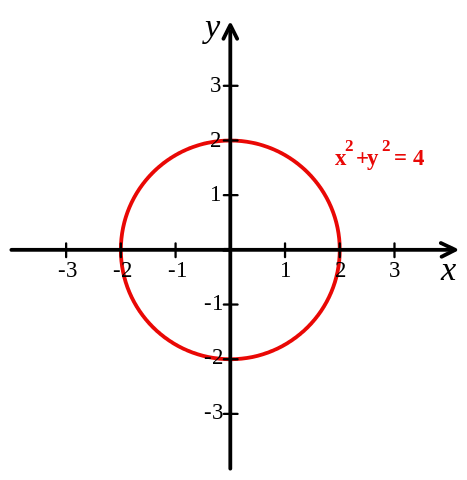

### 二维坐标系统

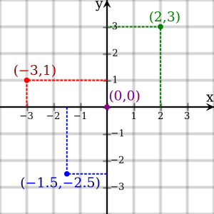

二维的直角坐标系通常由两个互相垂直的坐标轴设定，通常分别称为x-轴和 y-轴；两个坐标轴的相交点，称为原点，通常标记为O，既有“零”的意思，又是英语“Origin”的首字母。

每一个轴都指向一个特定的方向。这两个不同线的坐标轴，决定了一个平面，称为**xy-平面**，又称为**笛卡儿平面**。

直角坐标系的两个坐标轴将平面分成了四个部分，称为象限(Quadrant)，分别用罗马数字编号为 I(+, +)， II( - , +)，III ( - , - )，IV (+,  - )。所以，象限的编号是按照逆时针方向，从象限 I编到象限IV。

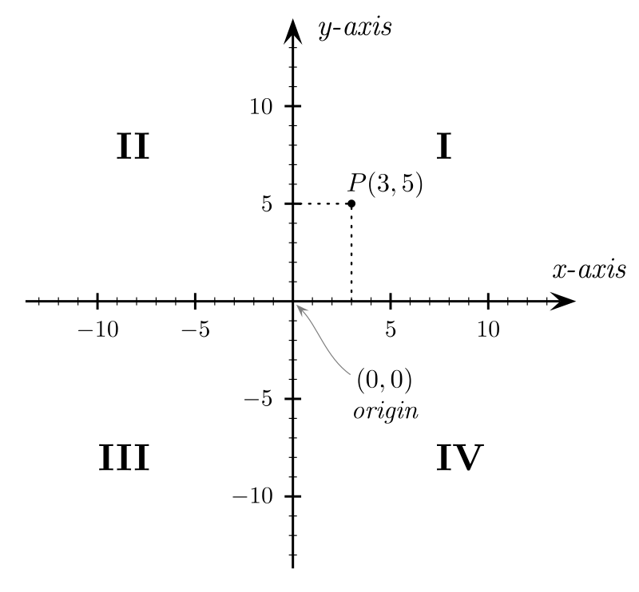

## Parametric equation(参数方程)

参数方程和函数很相似：它们都是由一些在指定的集的数，称为参数或自变数，以决定因变数的结果。例如在运动学，参数通常是“时间”，而方程的结果是速度、位置等。

一般地，在平面直角坐标系中，如果曲线上任意一点的坐标x、y都是某个变数`t`的函数：$x=f(t)$，$y=g(t)$，并且对于`t`的每一个允许的取值，由方程组确定的点`(x, y)`都在这条曲线上，那么这个方程就叫做曲线的参数方程，联系变数x、y的变数t叫做参变数，简称**参数**。相对而言，直接给出点坐标间关系的方程叫普通方程。

In mathematics, parametric equations define a group of quantities as functions of one or more independent variables called parameters.

Parametric equations are commonly used to express the coordinates of the points that make up a geometric(几何) object such as a curve or surface, in which case the equations are collectively called a parametric representation or parameterization (alternatively spelled as parametrization) of the object. For example, the equations

$x=cos(t),y=sin(t)$

form a parametric representation of the unit circle, where `t` is the parameter.

Note that parametric representations are generally nonunique , so the same quantities may be expressed by a number of different parameterizations.

### 常见参数方程

#### 过(h, k)，斜率为m的直线

$x=h+t, y=k+mt$

#### 圆

$x = r \cos t , y = r \sin t$

#### 椭圆

$x = a \cos t , y = b \sin t$

## Curve（曲线）

In mathematics, a curve (also called a curved line in older texts) is, generally speaking, an object similar to a line but that need not be straight. Thus, a curve is a generalization of a line, in that curvature is not necessarily zero.

曲线的普通定义就是在几何空间中的“弯曲了的线”。而直线是一种特殊的曲线，只不过它的曲率为零。在《解析几何》中，曲线用一组连续函数的方程组来表示。

## Least squares（最小二乘法）

最小二乘法（又称最小平方法）是一种数学优化技术。它通过最小化误差的平方和寻找数据的最佳函数匹配。

利用最小二乘法可以简便地求得未知的数据，并使得这些求得的数据与实际数据之间误差的平方和为最小。

## Calculus(微积分)

### Differential calculus(微分)

在数学中，微分是对函数的局部变化率的一种线性描述。微分可以近似地描述当函数自变量的取值作足够小的改变时，函数的值是怎样改变的。

当某些函数 $f$的自变量 $x$有一个微小的改变 $h$时，函数的变化可以分解为两个部分。

一个部分是线性部分：在一维情况下，它正比于自变量的变化量 $h$，可以表示成 $h$和一个与$h$无关，只与函数 $f$及 $x$有关的量的乘积；在更广泛的情况下，它是一个线性映射作用在$h$上的值。

另一部分是比 $h$ 更高阶的无穷小，也就是说除以 $h$后仍然会趋于零。当改变量 $h$很小时，第二部分可以忽略不计，函数的变化量约等于第一部分，也就是函数在 $x$ 处的微分，记作 $f'(x)h$或 $df_{x}(h)$。

如果一个函数在某处具有以上的性质，就称此函数在该点可微。不是所有的函数的变化量都可以分为以上提到的两个部分。若函数在某一点无法做到可微，便称函数在该点不可微。

#### 一元微分

设函数 $y = f(x)$在某区间 $\mathcal I$ 内有定义。对于 $\mathcal I$内一点 $x_0$，当 $x_0$变动到附近的 $x_{0}+\Delta x$（也在此区间内）时，如果函数的增量 $\Delta y = f(x_{0}+ \Delta x) - f(x_{0})$可表示为 $\Delta y = A \Delta x + o( \Delta x)$
通常把自变量 $x$的增量 $\Delta x$称为自变量的微分，记作 $\textrm{d}x$，即 $\textrm {d}x=\Delta x$。

### 导数（Derivative）

[导数](https://zh.wikipedia.org/wiki/%E5%AF%BC%E6%95%B0)是微积分学中重要的基础概念。一个函数在某一点的导数描述了这个函数在这一点附近的变化率。

导数的本质是通过极限的概念对函数进行局部的线性逼近。当函数 $f$的自变量在一点 $x_0$上产生一个增量 $h$时，函数输出值的增量与自变量增量$h$的比值在$h$趋于0时的极限如果存在，即为 $f$在 $x_0$处的导数，记作  $f'(x_0)$、 $\frac{df}{dx}(x_0)$、$\left.\frac{\mathrm{d}f}{\mathrm{d}x}\right|_{x=x_0}$。

例如在运动学中，物体的位移对于时间的导数就是物体的瞬时速度.

导数是函数的局部性质。不是所有的函数都有导数，一个函数也不一定在所有的点上都有导数。若某函数在某一点导数存在，则称其在这一点可导，否则称为不可导。如果函数的自变量和取值都是实数的话，那么函数在某一点的导数就是该函数所代表的曲线在这一点上的切线斜率。

对于可导的函数$f$， $x \mapsto f'(x)$也是一个函数，称作 $f$的导函数。寻找已知的函数在某点的导数或其导函数的过程称为求导。反之，已知导函数也可以倒过来求原来的函数，即不定积分。微积分基本定理说明了求原函数与积分是等价的。求导和积分是一对互逆的操作，它们都是微积分学中最为基础的概念。

## regression analysis(回归分析)

回归分析（英语：Regression Analysis）是一种统计学上分析数据的方法，目的在于了解两个或多个变数间是否相关、相关方向与强度，并建立数学模型以便观察特定变数来预测研究者感兴趣的变数。

更具体的来说，回归分析可以帮助人们了解在只有一个自变量变化时因变量的变化量。一般来说，通过回归分析我们可以由给出的自变量估计因变量的条件期望。

回归分析是建立因变数`Y`（或称依变数，反应变数）与自变数 `X`（或称独变数，解释变数）之间关系的模型。简单线性回归使用一个自变量 `X`，复回归使用超过一个自变量（`X_{1},X_{2}...X_{i}} X_{1},X_{2}...X_{i}`）。

### 回归模型

回归模型主要包括以下变量：

- 未知参数，记为β，可以代表一个标量或一个向量。
- 自变量，X。
- 因变量，Y。

回归模型将Y和一个关于X和β的函数关联起来：$Y \approx f(X, \beta)$

## linear regression(线性回归)

Linear regression is one of the most famous way to describe your data and make predictions on it. 

在统计学中，线性回归（Linear regression）是利用称为线性回归方程的`最小二乘`函数对一个或多个自变量和因变量之间关系进行建模的一种回归分析。

这种函数是一个或多个称为回归系数的模型参数的线性组合。只有一个自变量的情况称为`简单回归`，大于一个自变量情况的叫做`多元回归`。

### 单变量线性回归 (Linear Regression with One Variable)

单变量线性回归就是一个寻找线性方程式的过程。Finding the best-fitting straight line through points of a data set.

房价预测为例

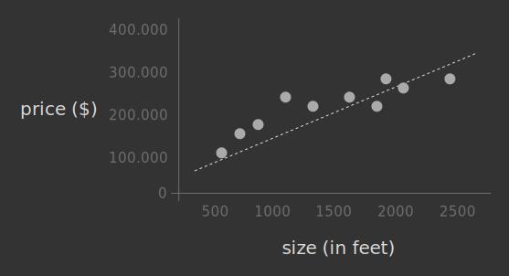

- 训练集(training set)

When you gathered your initial data, you actually created the so-called training set, which is the set of housing prices.

The algorithm's job is to learn from those data to predict prices of new houses. You are using input data to train the program, that's where the name comes from.

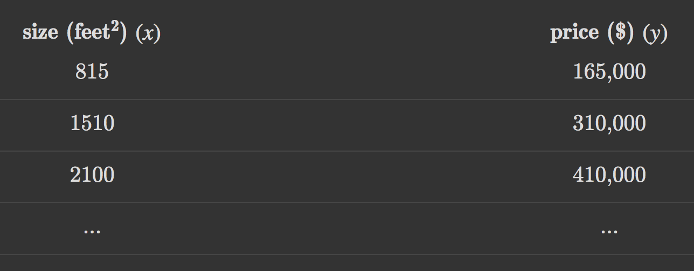

- $m$：代表训练集中实例的数量.
- $x$：代表特征/输入变量，这里代表房屋大小。
- $y$：代表目标变量/输出变量，这里代表房价。
- $(x,y)$：代表训练集中的实例。
- $(x^i,y^i)$：代表第$i$个观察实例。
- $(x^2,y^2)$：where $x^2=1510$ and $y^2=310,000$
- $h$：代表学习算法的解决方案或函数也称为假设（hypothesis, hīˈpäTHəsis）

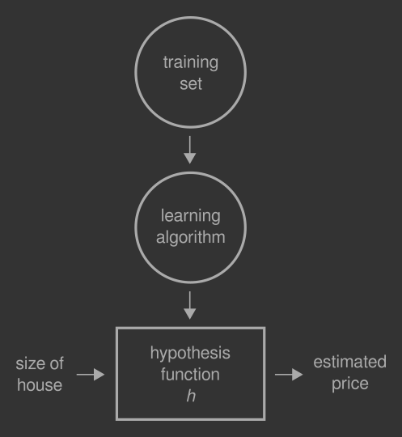

The training set of housing prices is fed into(喂) the learning algorithm(ˈalgəˌriT͟Həm). Its main job is to produce a function, which by convention is called $h$ (for hypothesis). You then use that hypothesis function to output the estimate(估算) house price $y$, by giving it the size of a house in input $x$.

#### The hypothesis function(预测函数式)

The hypothesis function must have a formula, like any other function in the world. That is:

$$h_\theta(x)=\theta_0+\theta_1(x)$$

Theta's ($\theta_i$ in general) are the parameters of the function. Usually the theta subscript(下标) gets dropped and the hypothesis function is simply written as $h(x)$.

In fact the hypothesis function is just the equation of the dotted line you can see in the picture 1.

In our hypothesis function there is only one variable, that is $x$. For this reason our task is often called **linear regression with one variable**. Experts call it also univariate(单变量) linear regression, where univariate means "one variable".

#### Cost function(代价函数, loss function)

##### 建模误差（modeling error）

我们选择的参数决定了我们得到的直线相对于我们的训练集的准确程度，模型所预测的值与训练集中实际值之间的差距就是建模误差。

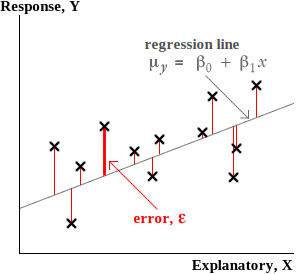

我们的目标便是选择出可以使得建模误差的平方和能够最小的模型参数。 即使得代价函数最小。

##### mean squared error (MSE，均方差)

From a mathematical point of view I want that, for each $i$-th point in my data set, the difference $h_θ(x^i)−y^i$ is very small. Here $h_θ(x^i)$ is the prediction of the hypothesis when it is input the size of house number $i$, while $y^i$ is the actual price of the house number $i$. If that difference is small, it means that the hypothesis has made an accurate prediction, because it's similar to the actual data.

If I plug our data into the MSE function, our final formula looks like that:

$${MSE}={\frac {1}{2m}}\sum_{i=1}^{m}({h_θ}(x^{(i)})−y^{(i)})^2$$

then

$${MSE}={\frac {1}{2m}}\sum_{i=1}^{m}({\theta_0}+{\theta_1 x^{(i)}}−y^{(i)})^2$$

By convention we would define a cost function (aka loss function) $J$ that is just the above equation written more compact:

$${J(\theta_0, \theta_1)}={\frac {1}{2m}}\sum_{i=1}^{m}({\theta_0}+{\theta_1 x^{(i)}}−y^{(i)})^2$$

Now, we want to find good values of $\theta_0$ and $\theta_1$, so good that the above cost function can produce the best possible values, namely the smallest ones (because small values mean less errors). This is an optimization problem: the problem of finding the best solution from all feasible solutions. It can be written as

$$\min_{\theta_0, \theta_1}J(\theta_0, \theta_1)$$

##### Cost function with one variable

This will help a lot with cost function visualization: keeping ${\theta_0}\neq 0$ would require a three-dimentional plot that initially would be a source of annoyance. Just remember: with ${\theta_0}= 0$ the hypothesis function becomes a line passing through the origin $(0,0)$, while $\theta_1$ controls the slope(斜度).

Picture shows the relationship between the hypothesis function and the cost function. Let's suppose that our data is made of three points as you may see in the leftmost plot.

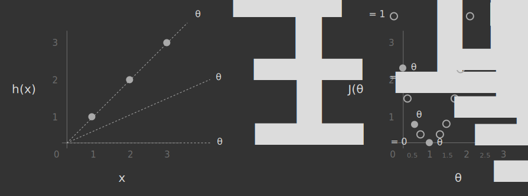

since ${\theta_0}= 0$ I can write the hypothesis function like that:
$${J(\theta_1=1)}={\frac {1}{2m}}\sum_{i=1}^{m}({\theta_1 x^{(i)}}−y^{(i)})^2$$

Now let's plug some numbers in:

$${J(\theta_1=1)} = {\frac {1}{6}}[{(1 \times 1 - 1)^2} + {(1 \times 2 - 2)^2} + {(1 \times 3 - 3)^2}] = 0$$

In words: for ${\theta_1}=1$, the cost function has produced a value of 0. Let's try with the other two values:

$${J(\theta_1=0.5)} = {\frac {1}{6}}[{(0.5 \times 1 - 1)^2} + {(0.5 \times 2 - 2)^2} + {(0.5 \times 3 - 3)^2}] \cong 0.6$$

$${J(\theta_1=0)} = {\frac {1}{6}}[{(0 \times 1 - 1)^2} + {(0 \times 2 - 2)^2} + {(0 \times 3 - 3)^2}] \cong 2.3$$

they reveal(揭示) that the cost function is actually a parabola(pəˈrabələ, 抛物线) with its minimum at 0.

Looking at the curve of the cost function, the value that minimizes $J(\theta_1)$ is ${\theta_1}=1$: that value means the best slope of the hypothesis function for our particular training set.

##### Cost function with two (or more) variables

I previously simplified the problem by setting $\theta_0$ to zero, a decision that led to a 2-dimensional cost function: great for learning purposes but not so realistic. In the real world 3-dimensional (and even more!) cost functions are quite common. Fortunately there are some neat ways to visualize them without losing too much information and mental sanity(合理).

The first approach is to just draw the actual function in three dimensions, as shown in picture. Just note that, not knowing the exact formula yet, axes values are more or less random.

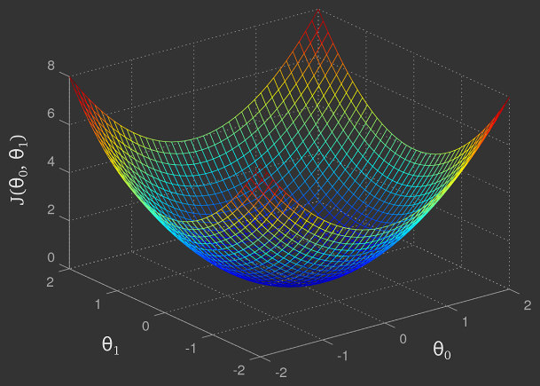

It looks like a cup and the optimization problem consists in finding the lowest point on the bottom edge.

Sometimes, when the picture becomes too messy(混乱), it's common to switch to another representation: the contour plot(轮廓图). A contour plot is a graphical technique for representing a 3-dimensional surface by plotting constant horizontal slices, called contours, on a 2-dimensional format. 

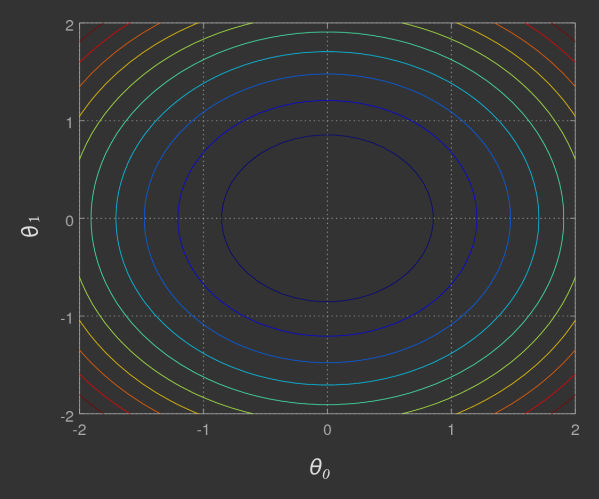

It's now much more easy to read, don't you think? Our optimization task now requires to find the exact center of that figure, where $\theta_0 = \theta_1 = 0$.

However so far we have just guessed for the best values of theta's, simply by looking at the function's plot. 

##### The gradient descent function(梯度下降函数)

梯度下降是一个用来求函数最小值的算法，我们将使用梯度下降算法来求出代价函数 $J(\theta_0,\theta_1)$ 的最小值 。

梯度下降背后的思想是：开始时我们随机选择一个参数的组合$(\theta_0,\theta_1,...,\theta_n)$，计算代价函数，然后我们寻找下一个能让代价函数值下降最多的参数组合。我们持续这么做，直到得到一个局部最小值（local minimum），因为我们并没有尝试完所有的参数组合，所以不能确定我们得到的局部最小值是否便是全局最小值（global minimum），选择不同的初始参数组合，可能会找到不同的局部最小值。

The picture below displays a generic three-dimensional function $J(\theta_0,\theta_1)$. There are only two $\theta$'s there, in order to generate an understandable plot. The height, or the vertical axis shows $J$, that is the output. Minimizing that function means to find the lowest values of $J$ that correspond to the blue depressed areas.

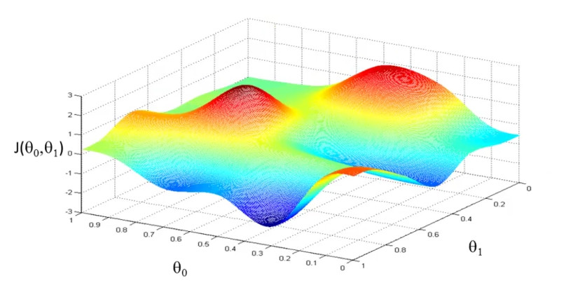

Picture below shows the baby steps experiment with two different routes. Your starting position on the hill corresponds to the initial values given to $\theta_0,\theta_1$. Black route has a slightly different starting point compared to the white one, which reveals an interesting property of the gradient descent algorithm: changing the initial value of theta's might lead you to a different minimum.

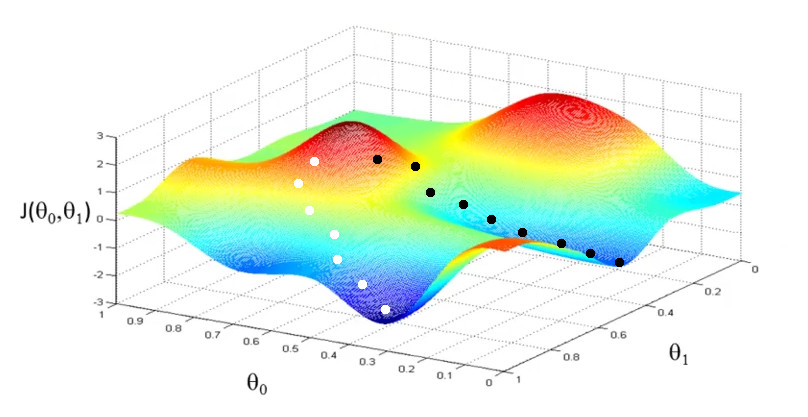

How to find the minimum of a function using an iterative algorithm.

$$\theta_j := \theta_j - \alpha \ast \frac{\delta}{\delta \theta_j}J(\theta_0, \theta_1, ... \theta_n)$$

$${for} \space\space j=0, j=1, ... j=n \space\space until \space\space convergence$$

###### $:=$

代表分配(assignment),It works like when you assign a value to a variable in a programming language, for example int x = 3.

###### $\alpha$ 

The term $\alpha$ is a number called learning rate(学习率). It basically controls the step size while descending the hill. Larger $\alpha$ means larger steps. 

The remaining part is a derivative(导数) of function $J$.

If $\alpha$ is too large, the algorithm can miss the minimum point, namely it fails to converge, as seen in picture below, right side. Worse, it could diverge, that is going further and further away from the minimum, taking up an infinite amount of time.

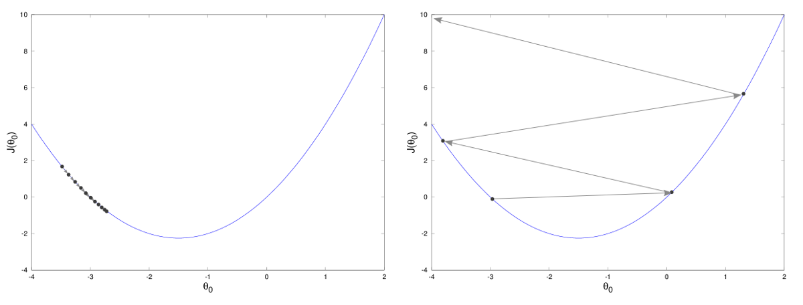

##### 执行梯度下降函数

The picture below briefly shows how the hypothesis function and the cost function progress as the whole thing runs.

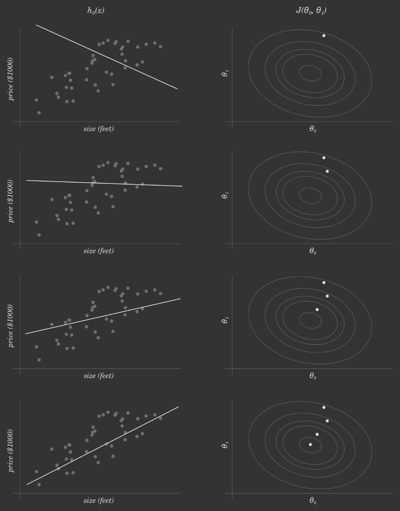

## 感谢及参考
- [Linear regression with one variable](https://www.internalpointers.com/post/linear-regression-one-variable)
- [The gradient descent function](https://www.internalpointers.com/post/gradient-descent-function)
- [The gradient descent in action](https://www.internalpointers.com/post/gradient-descent-action)
- [LaTeX Math Symbols](http://web.ift.uib.no/Teori/KURS/WRK/TeX/symALL.html)
- [LeftNotEasy](http://www.cnblogs.com/LeftNotEasy)